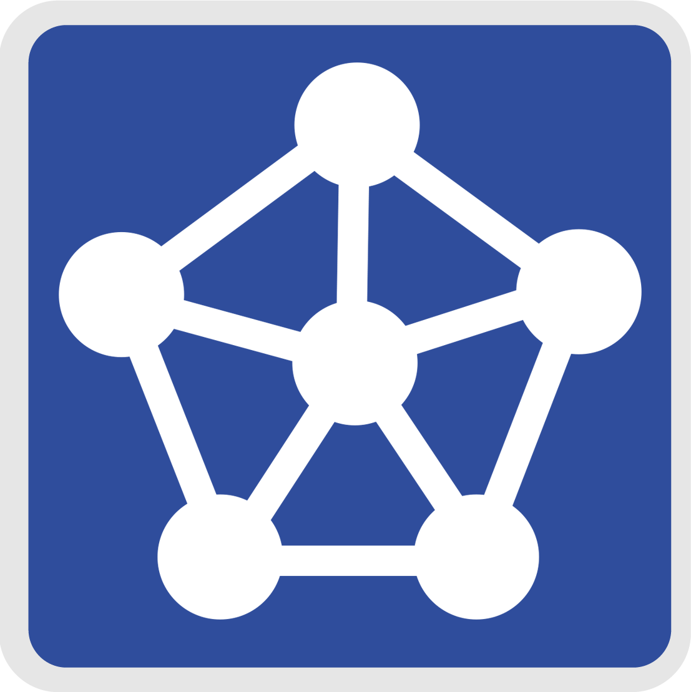

# Delft3D
This Delft3D repository contains the source code of the simulation engines of the [Delft3D 4](https://www.deltares.nl/en/software-and-data/products/delft3d-4-suite) and [Delft3D Flexible Mesh](https://www.deltares.nl/en/software-and-data/products/delft3d-flexible-mesh-suite) Suites developed by [Deltares](https://www.deltares.nl/en).
Both modelling suites can be used for the coastal, estuarine, river, rural and urban applications.
The Delft3D 4 Suite supports only structured grids.
Its successor, the Delft3D FM Suite, allows for unstructured grids including 1D networks.
The simulation engines cover hydrodynamics (D-Flow FM, Delft3D-FLOW), hydrology (D-Hydrology), real-time control (D-Real Time Control), morphodynamics (D-Morphology), waves (D-Waves, Delft3D-WAVE), water quality (D-Water Quality, Delft3D-WAQ) and particle tracking (Delft3D-PART).

## Documentation

For a description of the functionality included in the various components, please check the nightly draft builds of our [Delft3D 4 manuals](https://oss.deltares.nl/web/delft3d/manuals) and [Delft3D FM manuals](https://oss.deltares.nl/web/delft3dfm/downloads).

## Examples, tutorials and training

Most manuals (see documentation above) include a "Getting started" and/or "Tutorial" chapter.
This repository includes a few [example input files](examples/dflowfm) for the various simulation engines.
Furthermore, we organize various online and in-person Delft3D courses throughout the year.
The latest overview of scheduled Deltares courses is available on the [Deltares academy website](https://academy.deltares.nl/program?session-Language=en).

## Support packages

If you are interested in using these products, and do not (yet) want to compile or contribute to the development, then check out the following websites for the Delft3D Service Packages (note that these Service Packages cover both Delft3D 4 and Delft3D FM):

- **Delft3D 4 Suite website:** https://www.deltares.nl/en/software-and-data/products/delft3d-4-suite
- **Delft3D FM Suite:** https://www.deltares.nl/en/software-and-data/products/delft3d-flexible-mesh-suite

and contact our **sales team:** https://www.deltares.nl/en/software-and-data/software-sales-and-support-teams

## Bug reports

To limit the number of parallel communication channels and issue trackers, the issues tab has been removed on the Delft3D GitHub site.
In case you encounter bugs, please report them to our **support team:** https://www.deltares.nl/en/software-and-data/software-sales-and-support-teams

## Open Source Community

We have community websites for [Delft3D 4](https://oss.deltares.nl/web/delft3d) and [Delft3D FM](https://oss.deltares.nl/web/delft3dfm).
Source code repositories for the Delft3D [simulation engines](https://github.com/Deltares/Delft3D) (self-reference to this page unless you're looking at a forked version), the MATLAB-based postprocessing package [QUICKPLOT](https://github.com/Deltares/QUICKPLOT), the Python-based pre- and postprocessing packages [dfm_tools](https://github.com/Deltares/dfm_tools) and [hydrolib-core](https://github.com/Deltares/HYDROLIB-core), and our grid generation library [MeshKernel](https://github.com/Deltares/MeshKernel).

A set of pre-compiled user interfaces (Windows only) is available for Delft3D 4 after registration on the Deltares software website.
See [this page](https://download.deltares.nl/en/delft3d-4-gui-open-source) for details.
A similar package for Delft3D FM is expected to be released in the coming months.

### Compilation and development
For information on compiling, testing and development see the [development](doc/development.md) page.

### Contributing
If you want to contribute improvements or new features to our codebase, please see the [contributing](doc/contributing.md) page for information about developer guidelines, code branches and our review process.

## License
Most simulation engines are licensed under AGPL-3.0 or GPL-3.0, several utility libraries are licensed under LGPL-2.1, and several third-party packages under their original license. Details are listed in the respective subdirectories or source files.
